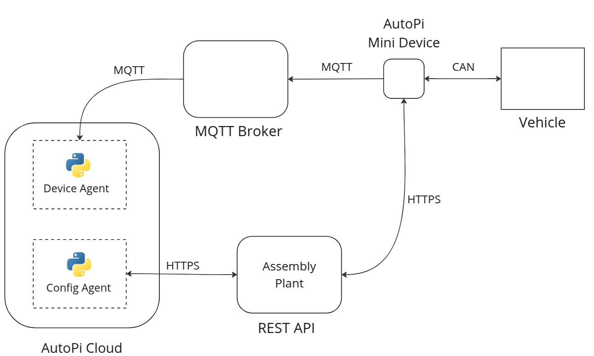

# Overview

10th semester project for Networks and Distributed Systems. 

This project builds on the 9th semester internship with AutoPi. An external organization which designs and operates IoT devices to collect data from a wide range of vehicles and machinery. These devices operate under different constraints that can result in performance issues. One of these devices in particular, the AutoPi Mini, works with different entities in a network like the one in the following diagram.  

### Objectives
1. **Handle message rate limitations**  
   Latency spikes and data loss occur when vehicle message rates increase, requiring manual configuration for each device, which is time-consuming.  

   - **Solution: Adaptive Device Configuration**  
     Implement automated configuration adjustments using Machine Learning or statistical techniques to dynamically adapt to changing message rates.

2. **Scalability of MQTT**  
   The impact of key parameters (QoS, message priorities) on scalability has not been fully explored. Critical questions remain:  
   - How many devices can a message broker handle before performance degrades?  
   - Could alternative protocols provide better efficiency?

   - **Solution: Message queueing optimization**  
     - Fine-tune MQTT settings to enhance performance.  
     - Benchmark alternative protocols such as gRPC and CoAP to evaluate their scalability and efficiency.

### Definitions  

- CAN sampling frequency: interval of time that each CAN signal from a vehicle sends data to the device. 

- Message arrival rate ($\lambda$): average number of CAN signal arrivals per time unit.  

- Service rate ($\mu$): average number of CAN signals processed per time unit.
  - Device service rate  (vehicle --> device --> message broker)
  - Message broker service rate   (device --> message broker --> cloud platform )
   
- Message priority: each CAN signal can be assigned a priority (which makes the signal jump to the front of the queue).

- Device configuration: it consists of a set of tuples (`can_sampling_frequency`, `msg_upload_frequency`, `priority`). 

- Latency: time it takes for a CAN signal to arrive to the cloud platform. 

- Data redundancy: CAN data that does not add significant changes to the data already present in the Cloud.

### Report Structure
  1. Introduction
  2. State of the art
  3. Methods
  4. Results
  5. Conclusion

#### References  
- Queueing theory
- Network protocols
  - CAN, MQTT, gRPC, CoAP, HTTP
- ML algorithms for network congestion / configurations

### Calendar
- February
  - Feb  3 - 7 : Project proposal
  - Feb 10 - 14: Plan for thesis supervision and lab work  **--> meeting** 
  - Feb 17 - 21: Submit thesis contract
  - Feb 24 - 28: Report 1st draft and framework for tests  

- March 
  - March  3 - 7:  Supervisor feedback        **--> meeting**
  - March 10 - 14: Testing   
  - March 17 - 24: 2nd test results
  - March 24 - 28: Report 2nd draft
  
- April 
  - April 1  - 4:  Supervisor feedback        **--> meeting**
  - April 7  - 11: Testing
  - April 14 - 18: Testing
  - April 21 - 25: Report 3rd draft and test results
  - April 28 - 30: Testing         
  
- May 
    - May   1 -  9: Supervisor feedback       **--> meeting**
    - May  12 - 16: Preliminary submission
    - May  19 - 23: Tests / feedback
    - May  26 - 30: Corrections from last feedback 
- June
  - June 2 - 6 : Project submission   

### February tasks

- Adaptive Configuration
  - Generate device dataset (configurations, collected CAN data)
  - Baseline configuration definition (what loggers are set up, what is the frequency)
  - Select statistical techniques
  - Select ML algorithms
- Message queueing optimization
  - Create local infrastructure for tests
  - Benchmark definition
  
- Report
    - Key terms definition
    - Define report structure